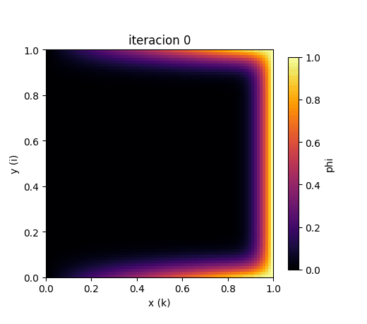
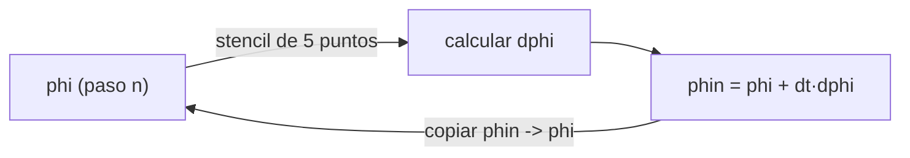
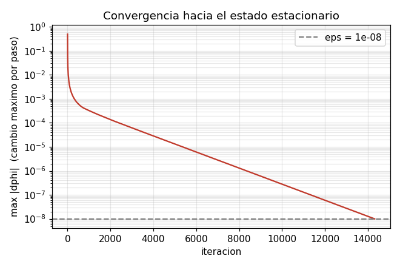
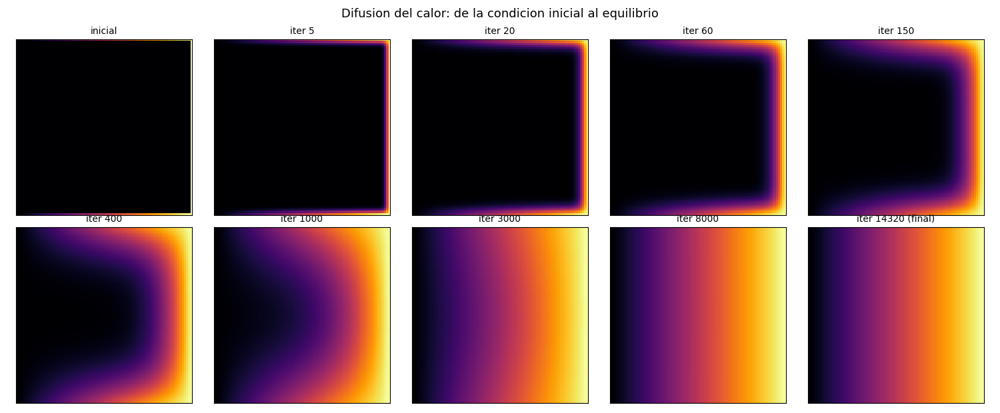
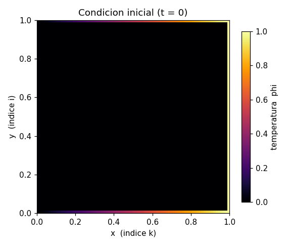
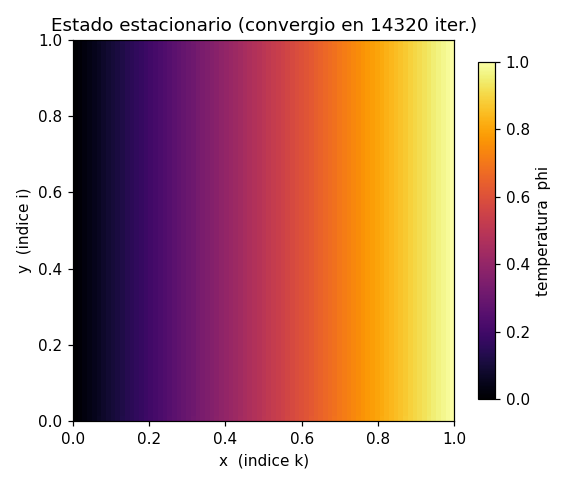
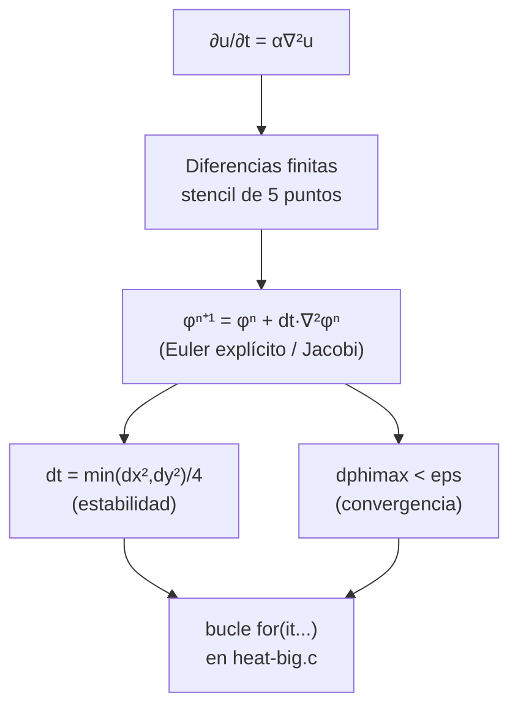
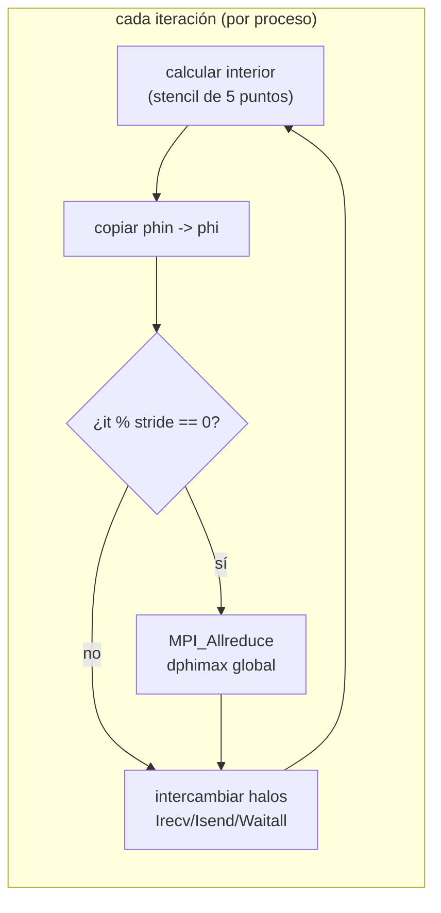
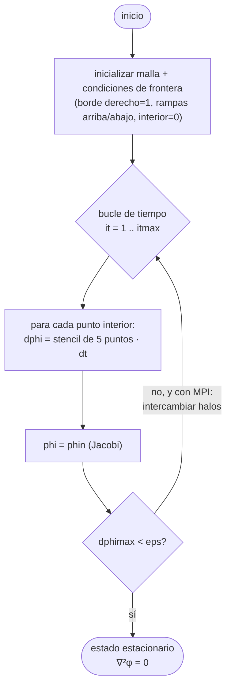

# La ecuación del calor: de la física al código

> Documento didáctico del proyecto **AHPC – Heat Equation**.
> Explica qué resuelve el código, cómo se discretiza el problema y cómo se mapea
> cada concepto a la implementación en C (`heat-big.c`) y su versión paralela
> con MPI (`heat-mpi-big.c`).
>
> Las figuras de este documento se generan con
> [`generate_figures.py`](generate_figures.py), que reproduce **exactamente** el
> solver del código C. Para regenerarlas:
>
> ```bash
> python3 docs/generate_figures.py
> ```

---

## Tabla de contenidos

1. [La idea física](#1-la-idea-física)
2. [La ecuación en 1D](#2-la-ecuación-en-1d)
3. [La ecuación en 2D](#3-la-ecuación-en-2d)
4. [De lo continuo a lo discreto: diferencias finitas](#4-de-lo-continuo-a-lo-discreto-diferencias-finitas)
5. [El stencil de 5 puntos](#5-el-stencil-de-5-puntos)
6. [El esquema explícito y la estabilidad](#6-el-esquema-explícito-y-la-estabilidad)
7. [El problema concreto de este código](#7-el-problema-concreto-de-este-código)
8. [Mapeo línea por línea al código C](#8-mapeo-línea-por-línea-al-código-c)
9. [Cómo se paraleliza: descomposición de dominio y halos (MPI)](#9-cómo-se-paraleliza-descomposición-de-dominio-y-halos-mpi)
10. [Resumen visual del flujo](#10-resumen-visual-del-flujo)

---

## 1. La idea física

La **ecuación del calor** describe cómo se redistribuye la temperatura en un
objeto a lo largo del tiempo. La intuición es simple:

> El calor fluye de lo caliente a lo frío, y la rapidez con que cambia la
> temperatura de un punto depende de **qué tan distinto es ese punto respecto al
> promedio de sus vecinos**.

Si un punto está más frío que sus vecinos, se calentará; si está más caliente, se
enfriará. Con el tiempo, las diferencias se suavizan hasta llegar a un
**equilibrio** (estado estacionario) en el que nada cambia más.

Esta animación —generada con las mismas condiciones que usa el código— muestra
exactamente eso: el calor entra por los bordes y difunde hacia el interior hasta
estabilizarse.



---

## 2. La ecuación en 1D

Imagina una barra delgada. Llamemos `u(x, t)` a la temperatura en la posición `x`
en el instante `t`. La ecuación del calor en una dimensión es:

$$\frac{\partial u}{\partial t} = \alpha \, \frac{\partial^2 u}{\partial x^2}$$

| Símbolo | Significado |
|---|---|
| $u(x,t)$ | temperatura en posición `x`, tiempo `t` |
| $\dfrac{\partial u}{\partial t}$ | qué tan rápido cambia la temperatura en el tiempo |
| $\dfrac{\partial^2 u}{\partial x^2}$ | **curvatura** del perfil de temperatura |
| $\alpha$ | difusividad térmica (propiedad del material; en este código $\alpha = 1$) |

### ¿Por qué la *segunda* derivada?

La segunda derivada mide la curvatura, y la curvatura indica si un punto está por
encima o por debajo del promedio de sus vecinos:

```
   temperatura
      ^
      |        ___                  • Pico (curvatura negativa):
      |      /     \                  el punto está MÁS caliente que sus
      |     /       \                 vecinos  ->  se ENFRÍA  (∂u/∂t < 0)
      |    /         \
      |___/___________\____            • Valle (curvatura positiva):
      |   \           /                 el punto está MÁS frío que sus
      |    \_________/                  vecinos  ->  se CALIENTA (∂u/∂t > 0)
      +-------------------> x
```

Por eso los picos se aplanan y los valles se rellenan: el sistema tiende a
suavizarse hasta que la curvatura es cero en todas partes (equilibrio).

---

## 3. La ecuación en 2D

Sobre una placa (dos dimensiones) la temperatura es `u(x, y, t)` y la difusión
ocurre en ambas direcciones a la vez. Solo sumamos la curvatura en `x` y en `y`:

$$\frac{\partial u}{\partial t} = \alpha \left( \frac{\partial^2 u}{\partial x^2} + \frac{\partial^2 u}{\partial y^2} \right)$$

El término entre paréntesis es el **operador Laplaciano**, $\nabla^2 u$. Mide cuánto
se desvía un punto respecto al promedio de sus vecinos en el plano.

$$\frac{\partial u}{\partial t} = \alpha \, \nabla^2 u$$

### Estado estacionario = ecuación de Laplace

Cuando el sistema deja de cambiar, $\partial u / \partial t = 0$, y la ecuación se
reduce a:

$$\nabla^2 u = 0 \qquad \text{(ecuación de Laplace)}$$

**Esto es justo lo que calcula este código:** itera en el tiempo hasta que la
temperatura deja de cambiar, obteniendo así la distribución de temperatura de
equilibrio. La iteración temporal es el *mecanismo* para llegar a la solución
estacionaria.

---

## 4. De lo continuo a lo discreto: diferencias finitas

Una computadora no puede manejar un continuo infinito de puntos. Por eso
**discretizamos**: reemplazamos la placa continua por una **malla** de puntos
separados una distancia `dx` (en x) y `dy` (en y), y el tiempo por pasos `dt`.

```
   y
   ^   o---o---o---o---o---o      o = punto de la malla (nodo)
   |   |   |   |   |   |   |
   |   o---o---o---o---o---o      separación horizontal = dx
   |   |   |   |   |   |   |      separación vertical   = dy
   |   o---o---o---o---o---o
   |   |   |   |   |   |   |      cada nodo guarda un valor de
   |   o---o---o---o---o---o      temperatura: phi[i][k]
   +-------------------------> x
```

La temperatura pasa a ser un arreglo: `phi[i][k]`, donde `i` indexa la dirección
`y` y `k` la dirección `x`.

### Aproximar derivadas con restas

La clave de las diferencias finitas es aproximar derivadas usando los valores
vecinos. La **segunda derivada** en `x` se aproxima así:

$$\frac{\partial^2 u}{\partial x^2} \approx \frac{u_{k+1} - 2\,u_k + u_{k-1}}{dx^2}$$

Fíjate en el numerador $u_{k+1} - 2·u_k + u_{k-1}$: es exactamente
*"(vecino derecho + vecino izquierdo) − 2 veces yo"*, la versión discreta de
"¿cuánto me desvío del promedio de mis vecinos?".

Lo mismo en `y`:

$$\frac{\partial^2 u}{\partial y^2} \approx \frac{u_{i+1} - 2\,u_i + u_{i-1}}{dy^2}$$

---

## 5. El stencil de 5 puntos

Al sumar las dos segundas derivadas, cada punto se actualiza usando **a sí mismo y
sus 4 vecinos directos**. Ese patrón se llama *stencil de 5 puntos*:

```
                    (i+1, k)
                       │
                       │  · dy2i
                       │
   (i, k-1) ──── (i, k) ──── (i, k+1)
        ·  dx2i     │     dx2i ·
                       │
                       │  · dy2i
                       │
                    (i-1, k)
```

El Laplaciano discreto en el nodo `(i, k)` es:

$$\nabla^2 \phi_{i,k} \approx \underbrace{\frac{\phi_{i+1,k} + \phi_{i-1,k} - 2\phi_{i,k}}{dy^2}}_{\text{vecinos en } y} + \underbrace{\frac{\phi_{i,k+1} + \phi_{i,k-1} - 2\phi_{i,k}}{dx^2}}_{\text{vecinos en } x}$$

En el código `dx2i = 1/dx²` y `dy2i = 1/dy²` están precalculados (es más rápido
multiplicar que dividir), de modo que esta fórmula aparece tal cual:

```c
dphi = (phi[idx(i+1,k)] + phi[idx(i-1,k)] - 2.*phi[idx(i,k)]) * dy2i
     + (phi[idx(i,k+1)] + phi[idx(i,k-1)] - 2.*phi[idx(i,k)]) * dx2i;
```

> Este stencil local es **la razón por la que el problema se paraleliza tan bien**:
> cada punto solo necesita a sus vecinos inmediatos, así que distintos procesos
> pueden trabajar regiones distintas y solo intercambiar la frontera. Ver
> [sección 9](#9-cómo-se-paraleliza-descomposición-de-dominio-y-halos-mpi).

---

## 6. El esquema explícito y la estabilidad

### Avance en el tiempo (Euler explícito / Jacobi)

Con la derivada temporal también aproximada por una diferencia hacia adelante,
$\partial u/\partial t \approx (\phi^{n+1} - \phi^n)/dt$, despejamos el valor
**nuevo** del punto en función de los valores **viejos**:

$$\phi_{i,k}^{\,n+1} = \phi_{i,k}^{\,n} + dt \cdot \nabla^2 \phi_{i,k}^{\,n}$$

En el código esto son dos líneas: calcular el incremento `dphi` y sumarlo.

```c
dphi = dphi * dt;                       // escalado por el paso de tiempo
phin[idxn(i,k)] = phi[idx(i,k)] + dphi; // valor nuevo = viejo + incremento
```

Nótese que se escribe en un arreglo **separado** `phin` y solo después se copia de
vuelta a `phi`. Así, todos los puntos de un paso se calculan con los valores del
paso anterior (método de **Jacobi**), no con valores ya actualizados.



### La condición de estabilidad

El método explícito es simple y rápido, pero tiene un precio: si el paso de tiempo
`dt` es demasiado grande, la simulación **se vuelve inestable y explota** (los
números crecen sin sentido). En 2D la condición de estabilidad es:

$$dt \le \frac{1}{2\alpha} \cdot \frac{dx^2 \, dy^2}{dx^2 + dy^2}$$

Para una malla cuadrada ($dx = dy$, $\alpha = 1$) esto se simplifica a
$dt \le dx^2/4$. Por eso el código elige justo:

```c
dt = min(dx2, dy2) / 4.e0;   // en el límite de estabilidad
```

> **Implicación para HPC:** como `dt` debe ser pequeño y proporcional a `dx²`, una
> malla más fina obliga a dar *muchísimos* pasos de tiempo. De ahí la necesidad de
> paralelizar.

### Criterio de parada (convergencia)

No iteramos por siempre: paramos cuando el cambio máximo en un paso cae por debajo
de una tolerancia `eps`, señal de que llegamos al estado estacionario.

```c
dphimax = max(dphimax, dphi);   // mayor cambio de este paso
...
if (dphimax < eps) goto endOfLoop;   // eps = 1e-8
```

La siguiente curva muestra cómo `max|dphi|` decae hasta cruzar `eps`. En este
problema converge en **~14 300 iteraciones**:



---

## 7. El problema concreto de este código

El código resuelve la ecuación del calor en el **cuadrado unitario** $[0,1]\times[0,1]$
con una malla de **80 × 80** (`imax = kmax = 80`), con estas condiciones de
frontera fijas (tipo **Dirichlet** — el valor del borde no cambia nunca):

```
                 borde superior:  phi = k·dx   (rampa lineal 0 -> 1)
        x=0  ┌───────────────────────────────────┐  x=1
             │ 0.0  →   →   →   →   →   →   →  1.0 │
             │                                   │
   borde     │                                   │   borde
 izquierdo   │            INTERIOR               │  derecho
  phi = 0    │          (inicia en 0)            │  phi = 1
             │                                   │  (caliente)
             │ 0.0  →   →   →   →   →   →   →  1.0 │
             └───────────────────────────────────┘
                 borde inferior:  phi = k·dx   (rampa lineal 0 -> 1)
```

| Frontera | Condición | En el código |
|---|---|---|
| Columna derecha (`k = kmax`) | `phi = 1` (caliente) | `phi[idx(i,kmax)] = 1.0` |
| Columna izquierda (`k = 0`) | `phi = 0` (fría) | queda en 0 |
| Fila superior (`i = 0`) | rampa `phi = k·dx` | `phi[idx(istart,k)] = (k-kstart)*dx` |
| Fila inferior (`i = imax`) | rampa `phi = k·dx` | `phi[idx(imax,k)] = (k-kstart)*dx` |
| Interior | inicia en `0` | `phi[idx(i,k)] = 0` |

Partiendo de un interior frío, el calor difunde desde los bordes hasta alcanzar el
equilibrio. Estas instantáneas muestran la evolución:



Y el resultado final (estado estacionario): un gradiente suave de frío (izquierda)
a caliente (derecha), que satisface $\nabla^2 \phi = 0$:

| Condición inicial | Estado estacionario |
|---|---|
|  |  |

---

## 8. Mapeo línea por línea al código C

Esta sección conecta cada concepto con `heat-big.c` (versión serial, la más fácil
de leer).

### Direccionamiento del arreglo

El arreglo 2D se guarda como un bloque 1D (*row-major*). Las macros traducen
`(i, k)` a un índice plano:

```c
#define idx(i,k)  (((i)-is)  *kouter + (k)-ks)   // arreglo phi  (incluye bordes/halos)
#define idxn(i,k) (((i)-is-1)*kinner + (k)-ks-1) // arreglo phin (solo el interior)
```

- `phi` tiene tamaño `iouter × kouter` (incluye los bordes).
- `phin` tiene tamaño `iinner × kinner` (solo los nodos interiores que se actualizan).
- `is, ie, ks, ke` son los índices de inicio/fin del subdominio. En serial cubren
  todo el dominio; con MPI cubren solo la porción de cada proceso (ver sección 9).

### Parámetros de la malla

```c
dx = 1.e0 / (kmax - kstart);   // espaciado en x
dy = 1.e0 / (imax - istart);   // espaciado en y
dx2i = 1.e0 / dx2;             // 1/dx²  precalculado
dy2i = 1.e0 / dy2;             // 1/dy²  precalculado
dt = min(dx2, dy2) / 4.e0;     // paso de tiempo en el límite de estabilidad
```

### El bucle de iteración (el corazón del solver)

```c
for (it = 1; it <= itmax; it++) {
    dphimax = 0.;

    // 1) calcular el nuevo valor de cada punto interior con el stencil de 5 puntos
    for (i = is+b1; i <= ie-b1; i++) {
      for (k = ks+b1; k <= ke-b1; k++) {
        dphi = (phi[idx(i+1,k)] + phi[idx(i-1,k)] - 2.*phi[idx(i,k)]) * dy2i
             + (phi[idx(i,k+1)] + phi[idx(i,k-1)] - 2.*phi[idx(i,k)]) * dx2i;
        dphi = dphi * dt;
        dphimax = max(dphimax, dphi);          // rastrea el mayor cambio
        phin[idxn(i,k)] = phi[idx(i,k)] + dphi; // escribe en buffer separado
      }
    }

    // 2) copiar phin -> phi (esquema de Jacobi: doble buffer)
    for (i = is+b1; i <= ie-b1; i++)
      for (k = ks+b1; k <= ke-b1; k++)
        phi[idx(i,k)] = phin[idxn(i,k)];

    // 3) ¿convergió?
    if (dphimax < eps) goto endOfLoop;
}
```

`b1 = 1` es el ancho del borde: el bucle recorre el interior `is+1 .. ie-1`,
dejando intactos los bordes (las condiciones de frontera).

### Correspondencia concepto ↔ código



---

## 9. Cómo se paraleliza: descomposición de dominio y halos (MPI)

`heat-mpi-big.c` resuelve **el mismo problema**, pero reparte la malla entre varios
procesos MPI. El algoritmo numérico es idéntico; lo que cambia es *quién calcula
qué* y *cómo intercambian datos*.

### Descomposición de dominio 2D

La malla se parte en una rejilla de subdominios, uno por proceso, usando un
**comunicador cartesiano** de MPI:

```c
MPI_Dims_create(numprocs, 2, dims);              // elige rejilla idim × kdim
MPI_Cart_create(MPI_COMM_WORLD, 2, dims, period, 1, &comm);
MPI_Cart_coords(comm, my_rank, 2, coords);       // (icoord, kcoord) de este proceso
MPI_Cart_shift(comm, 0, 1, &left,  &right);      // vecinos en y
MPI_Cart_shift(comm, 1, 1, &lower, &upper);      // vecinos en x
```

```
   malla global 80×80 repartida entre 4 procesos (rejilla 2×2):

        kcoord=0          kcoord=1
      ┌───────────┬───────────┐
icoord│  rank 0   │  rank 1   │   cada proceso guarda su trozo
  =0  │           │           │   MÁS una capa extra de "halo"
      ├───────────┼───────────┤   alrededor (copia de la frontera
icoord│  rank 2   │  rank 3   │   del vecino).
  =1  │           │           │
      └───────────┴───────────┘
```

El reparto de los puntos (incluyendo el caso en que `80` no es divisible entre el
número de procesos) lo calcula el código repartiendo el resto: los primeros `in1`
procesos reciben un punto extra (`iinner0 + 1`) y el resto `iinner0`. Lo mismo en
la dirección `k`.

### El problema de la frontera: celdas halo

El stencil de 5 puntos necesita los 4 vecinos de cada nodo. Pero los nodos en el
**borde de un subdominio** tienen vecinos que pertenecen a *otro* proceso. La
solución clásica: cada proceso rodea su trozo con una capa extra de **celdas halo**
(*ghost cells*) que contienen una copia de la fila/columna frontera del vecino.

```
   subdominio de un proceso (· = interior propio, H = halo del vecino):

        H H H H H H H        En cada iteración:
        H · · · · · H          1. calcular el interior (·) con el stencil
        H · · · · · H          2. INTERCAMBIAR los halos (H) con los vecinos
        H · · · · · H          3. repetir
        H · · · · · H
        H H H H H H H        El halo se actualiza por comunicación, no por cálculo.
```

### El intercambio de halos

Cada paso de tiempo, antes de volver a calcular, los procesos se envían sus
fronteras con comunicación **no bloqueante** (`MPI_Irecv` / `MPI_Isend` +
`MPI_Waitall`):

```c
// intercambio con los vecinos de arriba/abajo (dirección x)
MPI_Irecv(&phi[idx(is+b1,ks)],    1, horizontal_border, lower, 1, comm, &req[0]);
MPI_Irecv(&phi[idx(is+b1,ke)],    1, horizontal_border, upper, 2, comm, &req[1]);
MPI_Isend(&phi[idx(is+b1,ke-b1)], 1, horizontal_border, upper, 1, comm, &req[2]);
MPI_Isend(&phi[idx(is+b1,ks+b1)], 1, horizontal_border, lower, 2, comm, &req[3]);
MPI_Waitall(4, req, statuses);
// ... y análogamente con left/right en la dirección y
```

Como una fila o columna no es contigua en memoria, se usan **tipos derivados** de
MPI para describir el patrón de salto:

```c
MPI_Type_create_subarray(2, gsizes, lsizes, starts, MPI_ORDER_C,
                         MPI_DOUBLE, &vertical_border);
MPI_Type_commit(&vertical_border);
```



### Convergencia global

Cada proceso solo conoce el cambio máximo de **su** trozo. Para decidir si *todo*
el dominio convergió, se combina el máximo de todos con una reducción global. Para
no pagar ese costo en cada paso, solo se hace cada `stride` iteraciones:

```c
if ((it % stride) == 0) {
    dphimaxpartial = dphimax;
    MPI_Allreduce(&dphimaxpartial, &dphimax, 1, MPI_DOUBLE, MPI_MAX, comm);
    if (dphimax < eps) goto endOfLoop;
}
```

### ¿Qué se mide en el proyecto?

La versión MPI cronometra por separado el **cómputo**, la **comunicación** (halos)
y el **criterio de parada** (`MPI_Wtime`). Eso alimenta el análisis de
*speedup* y *eficiencia* al variar el número de procesos `p` y el tamaño `n` —el
objetivo central del proyecto (ver [`README.md`](../README.md)).

---

## 10. Resumen visual del flujo



| Concepto físico/numérico | Dónde vive en el código |
|---|---|
| Ecuación del calor 2D | todo el solver |
| Malla discreta `phi[i][k]` | `malloc` de `phi`, macros `idx`/`idxn` |
| Stencil de 5 puntos (Laplaciano) | cálculo de `dphi` con `dx2i`, `dy2i` |
| Avance temporal explícito | `phin = phi + dt*dphi` |
| Estabilidad | `dt = min(dx2,dy2)/4` |
| Condiciones de frontera (Dirichlet) | bloques de "start values" |
| Convergencia | `dphimax < eps` |
| Paralelización | descomposición cartesiana + halos (`heat-mpi-big.c`) |

---

### Para seguir explorando

- Cambia `imax`/`kmax` en el `.c` y regenera las figuras ajustando los mismos
  valores en [`generate_figures.py`](generate_figures.py) para ver cómo una malla
  más fina aumenta el número de iteraciones.
- Compara los tiempos `wall clock` que imprime `heat-mpi-big.c` con distinto
  número de procesos para construir las curvas de *speedup* y *eficiencia*.
