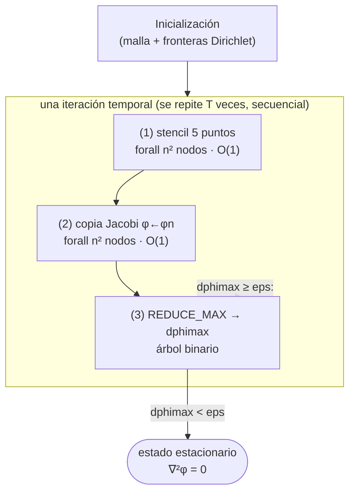

# PRAM y complejidad teórica del solver de la ecuación de calor

## Tabla de contenidos

1. [El modelo PRAM y por qué aplica aquí](#1-el-modelo-pram-y-por-qué-aplica-aquí)
2. [El algoritmo expresado como programa PRAM](#2-el-algoritmo-expresado-como-programa-pram)
3. [El DAG del algoritmo y su anotación de complejidad](#3-el-dag-del-algoritmo-y-su-anotación-de-complejidad)
4. [Número de iteraciones hasta converger: T = Θ(n²)](#4-número-de-iteraciones-hasta-converger-t--θn²)
5. [Análisis trabajo–profundidad (work–depth)](#5-análisis-trabajodepth-workdepth)
6. [Tiempo PRAM, speedup, eficiencia y costo](#6-tiempo-pram-speedup-eficiencia-y-costo)
7. [Del PRAM a la realidad: memoria distribuida y halos (MPI)](#7-del-pram-a-la-realidad-memoria-distribuida-y-halos-mpi)
8. [Isoeficiencia y número óptimo de procesos](#8-isoeficiencia-y-número-óptimo-de-procesos)
9. [Resumen de complejidades y enlace con las métricas medidas](#9-resumen-de-complejidades-y-enlace-con-las-métricas-medidas)
10. [Referencias](#10-referencias)

### Notación

| Símbolo | Significado |
|---|---|
| $n$ | lado de la malla de incógnitas (interior); número de nodos $N = n^2$. En el código `imax = kmax`, $n \approx \text{imax}-1$ |
| $N = n^2$ | número total de nodos/incógnitas que se actualizan por paso |
| $p$ | número de procesadores (PRAM) / procesos MPI |
| $T$ | número de pasos de tiempo (iteraciones) hasta cumplir el criterio `dphimax < eps` |
| $W_1$ | trabajo total (operaciones secuenciales) = tiempo del algoritmo en 1 procesador |
| $D_\infty$ | profundidad (*depth* / *span*): la cadena de dependencias más larga |
| $T_p$ | tiempo de ejecución con $p$ procesadores |
| $t_s,\ t_w$ | latencia por mensaje (*startup*) y costo por palabra (1/ancho de banda) |

---

## 1. El modelo PRAM y por qué aplica aquí

El **PRAM** (*Parallel Random Access Machine*) es el modelo teórico estándar para
diseñar y analizar algoritmos paralelos: $p$ procesadores síncronos comparten una
memoria global, y en cada paso cada procesador activo ejecuta una operación de
costo $O(1)$ (leer, calcular, escribir) [JáJá 1992; Chatterjee–Prins]. Es el
análogo paralelo del modelo RAM secuencial e **ignora a propósito el costo de
comunicación**, para aislar el *paralelismo intrínseco* del algoritmo.

Sus variantes se distinguen por cómo manejan accesos simultáneos a la **misma**
celda:

| Variante | Lectura concurrente | Escritura concurrente |
|---|---|---|
| EREW | ✗ | ✗ |
| **CREW** | ✓ | ✗ |
| CRCW | ✓ | ✓ |

**Nuestro solver es naturalmente CREW:**

- **Lectura concurrente (CR):** el *stencil* de 5 puntos hace que cada celda
  $\phi_{i,k}$ sea **leída por hasta 5 procesadores** a la vez (el nodo que la
  posee y sus 4 vecinos). Estas son lecturas del arreglo *viejo* `phi`.
- **Escritura exclusiva (EW):** el esquema de **Jacobi de doble buffer** escribe el
  resultado en un arreglo *separado* `phin` —una celda por procesador, sin
  colisiones— y solo después copia `phin → phi`. No hay dos procesadores
  escribiendo la misma posición.

Esta propiedad —*cada punto depende solo de sus vecinos inmediatos y los nuevos
valores no se pisan entre sí*— es exactamente la que hace que el problema sea
**vergonzosamente paralelo dentro de cada paso de tiempo** y la base de toda la
escalabilidad analizada abajo.

> Nota: el modelo PRAM da la cota **optimista** (sin comunicación). La sección 7
> añade el costo de los halos y la reducción, que es lo que realmente limita el
> *speedup* medido.

---

## 2. El algoritmo expresado como programa PRAM

Reescribimos el bucle de [`heat-mpi-big.c`](../src/heat-mpi-big.c) (líneas 239–297)
en notación PRAM. `forall` denota un bucle cuyas iteraciones se reparten entre los
$p$ procesadores y se ejecutan en paralelo.

```text
Entrada: malla φ[0..n+1, 0..n+1] con condiciones de frontera (Dirichlet)
Parámetros: dt = min(dx²,dy²)/4   (límite de estabilidad CFL)
            eps = 1e-8            (tolerancia de convergencia)

para it = 1, 2, 3, …                      ▷ SECUENCIAL: cada paso usa el anterior
  ───────────────────────────────────────────────────────────────────────────
  (1) forall (i,k) en el interior  [n² tareas independientes]      ▷ O(1) c/u
        dphi      ← (φ[i+1,k]+φ[i-1,k]−2φ[i,k])·dy2i
                  + (φ[i,k+1]+φ[i,k-1]−2φ[i,k])·dx2i
        dphi      ← dphi · dt
        φn[i,k]   ← φ[i,k] + dphi
        local[i,k]← |dphi|                 ▷ contribución al criterio de parada
  ───────────────────────────────────────────────────────────────────────────
  (2) forall (i,k) en el interior          ▷ copia Jacobi  φ ← φn   [O(1) c/u]
        φ[i,k] ← φn[i,k]
  ───────────────────────────────────────────────────────────────────────────
  (3) dphimax ← REDUCE_MAX( local[i,k] )   ▷ reducción en árbol: profundidad O(log n²)
      si dphimax < eps  →  terminar        ▷ estado estacionario alcanzado
```

Tres observaciones clave para el análisis:

1. **Dentro de un paso**, los bloques (1) y (2) son `forall` puros: $n^2$ tareas
   independientes de costo $O(1)$ → profundidad $O(1)$, trabajo $O(n^2)$.
2. **El criterio de parada (3)** no es independiente: combinar el máximo de los
   $n^2$ valores es una **reducción**, cuya profundidad óptima es
   $O(\log n^2)=O(\log n)$ (árbol binario) y trabajo $O(n^2)$.
3. **Entre pasos** existe una dependencia estricta: $\phi^{n+1}$ necesita
   $\phi^{n}$ completo. El bucle `para it` es **inherentemente secuencial**; el
   paralelismo vive *dentro* de cada paso, no a lo largo del tiempo. Esto fija el
   límite inferior de profundidad del algoritmo completo.

---

## 3. El DAG del algoritmo y su anotación de complejidad

Igual que el DAG de KNN del enunciado, anotamos cada fase con su costo. Cada
iteración temporal es una capa del grafo de dependencias (DAG); las capas se
encadenan $T$ veces.



Anotación de costos (sobre el modelo PRAM con $p$ procesadores), **por iteración**:

| Fase | Trabajo (work) | Profundidad (depth) | Tiempo con $p$ procesadores |
|---|---|---|---|
| (1) stencil | $\Theta(n^2)$ | $\Theta(1)$ | $\Theta(n^2/p)$ |
| (2) copia Jacobi | $\Theta(n^2)$ | $\Theta(1)$ | $\Theta(n^2/p)$ |
| (3) reduce máximo | $\Theta(n^2)$ | $\Theta(\log n)$ | $\Theta(n^2/p + \log p)$ |
| **por iteración** | $\Theta(n^2)$ | $\Theta(\log n)$ | $\Theta(n^2/p + \log p)$ |

> El cuello de botella de **profundidad** dentro de un paso es la reducción del
> criterio de parada: $\Theta(\log n)$. Todo lo demás es $\Theta(1)$.
> En el código MPI esa reducción es el `MPI_Allreduce` —y por eso se hace solo
> cada `stride = 10` pasos, una optimización que el modelo justifica (sección 7).

---

## 4. Número de iteraciones hasta converger: T = Θ(n²)

La complejidad **total** depende de cuántos pasos $T$ se necesitan, y $T$ **no es
constante**: crece con la malla. Esto es consecuencia directa del esquema
explícito.

**Estabilidad (CFL).** El análisis de estabilidad de von Neumann para el esquema
FTCS (Euler hacia adelante + diferencias centradas) en 2D exige
$$dt \le \frac{1}{2\alpha}\,\frac{dx^2\,dy^2}{dx^2+dy^2}
\;\xrightarrow{\;dx=dy,\ \alpha=1\;}\; dt \le \frac{dx^2}{4},$$
que es justo lo que fija el código (`dt = min(dx2,dy2)/4`). Como
$dx = 1/n$, tenemos $dt = \Theta(1/n^2)$ [MIT 18.300; Wikipedia vNSA].

**Tasa de convergencia.** Iterar el esquema explícito hasta el estado estacionario
equivale a una **iteración de Jacobi** sobre la ecuación de Laplace. El error se
descompone en modos de Fourier; el modo más lento decae por iteración con un
factor $\approx 1 - \Theta(dt\cdot \lambda_{\min})$, donde $\lambda_{\min}=2\pi^2$
es el menor autovalor del Laplaciano en el cuadrado unitario (constante,
independiente de $n$). El número de pasos para llevar ese modo bajo `eps` es
$$T \;=\; \Theta\!\left(\frac{1}{dt\,\lambda_{\min}}\right) \;=\; \Theta\!\left(\frac{1}{dt}\right) \;=\; \Theta(n^2).$$

**Validación empírica.** En la malla $80\times80$ del proyecto ($n^2 = 6400$) el
solver converge en $\approx 14{,}300$ iteraciones (ver
[`heat-equation.md` §6](heat-equation.md)). El cociente
$14300/6400 \approx 2.2$ es la constante $\Theta(\cdot)$, y se mantendrá
aproximadamente constante al cambiar $n$ — una predicción concreta y verificable
en el objetivo (b).

> **Implicación HPC:** afinar la malla cuesta doble. Duplicar $n$ multiplica por 4
> el trabajo por paso **y** por 4 el número de pasos → el costo serial crece como
> $n^4$. De ahí la necesidad de paralelizar.

---

## 5. Análisis trabajo–profundidad (work–depth)

Combinando el costo por iteración (§3) con $T=\Theta(n^2)$ (§4):

**Trabajo total (= tiempo secuencial, 1 procesador):**
$$\boxed{\,W_1 \;=\; T_1 \;=\; \Theta(T\cdot n^2) \;=\; \Theta(n^2 \cdot n^2) \;=\; \Theta(n^4) \;=\; \Theta(N^2)\,}$$

**Profundidad total (cadena crítica):** los $T$ pasos son secuenciales y cada uno
aporta profundidad $\Theta(\log n)$:
$$\boxed{\,D_\infty \;=\; \Theta(T\cdot \log n) \;=\; \Theta(n^2 \log n)\,}$$

**Paralelismo disponible** (cuántos procesadores puede aprovechar el algoritmo):
$$\frac{W_1}{D_\infty} \;=\; \frac{\Theta(n^4)}{\Theta(n^2 \log n)} \;=\; \Theta\!\left(\frac{n^2}{\log n}\right).$$

Es decir, el algoritmo puede usar de forma útil hasta $\approx n^2$ procesadores
(uno por nodo de la malla, salvo el factor $\log n$ de la reducción). Más allá de
eso, los procesadores extra quedan ociosos.

**Teorema de Brent.** Para cualquier $p$, el tiempo PRAM cumple
$$\frac{W_1}{p} \;\le\; T_p \;\le\; \frac{W_1}{p} + D_\infty
\;=\; O\!\left(\frac{n^4}{p} + n^2\log n\right).$$
Esta es la cota que conecta el modelo trabajo–profundidad con una máquina de $p$
procesadores [Brent 1974; Blelloch–Maggs; Stanford CME323].

---

## 6. Tiempo PRAM, speedup, eficiencia y costo

A partir del costo por iteración $\Theta(n^2/p + \log p)$ (§3) y $T=\Theta(n^2)$:

$$\boxed{\,T_p \;=\; \Theta\!\Big(n^2\big(\tfrac{n^2}{p} + \log p\big)\Big)
\;=\; \Theta\!\left(\frac{n^4}{p} + n^2\log p\right)\,}$$

- Con el **máximo paralelismo** $p=n^2$: $T_{n^2}=\Theta(n^2\log n)$, que coincide
  con $D_\infty$ — el algoritmo es *óptimo en profundidad*.

**Speedup** (respecto del óptimo secuencial $T_1=\Theta(n^4)$):
$$S_p \;=\; \frac{T_1}{T_p} \;=\; \frac{n^4}{\,n^4/p + n^2\log p\,}
\;=\; \frac{p}{\,1 + \dfrac{p\log p}{n^2}\,}.$$

**Eficiencia:**
$$\boxed{\,E_p \;=\; \frac{S_p}{p} \;=\; \frac{1}{\,1 + \dfrac{p\log p}{n^2}\,}\,}$$

- $E_p \to 1$ (speedup casi lineal) **mientras** $n^2 \gg p\log p$.
- La eficiencia se degrada cuando $p$ se acerca a $n^2$ — exactamente cuando el
  trabajo por procesador ($n^2/p$) se vuelve comparable al costo $\log p$ de la
  reducción.

**Costo** (procesadores × tiempo) y *cost-optimalidad*:
$$C_p = p\cdot T_p = \Theta(n^4 + p\,n^2\log p).$$
El algoritmo paralelo es **cost-optimal** (mismo orden que el trabajo secuencial
$\Theta(n^4)$) siempre que $p\log p = O(n^2)$, es decir
$$p \;=\; O\!\left(\frac{n^2}{\log n}\right).$$

Esta es la **cota teórica del número útil de procesos** en el modelo idealizado;
la sección 8 la corrige a la baja al incluir la comunicación real.

---

## 7. Del PRAM a la realidad: memoria distribuida y halos (MPI)

El PRAM supone comunicación gratis. El código real es **memoria distribuida**:
cada proceso solo ve su trozo y debe **comunicar** explícitamente. Modelamos el
costo con el modelo BSP / latencia–ancho de banda: enviar un mensaje de $m$
palabras cuesta $t_s + t_w\,m$ ($t_s$ = latencia/*startup*, $t_w$ = costo por
palabra) [Grama et al., cap. 4–5].

**Descomposición de dominio 2D.** `MPI_Dims_create` reparte la malla en una rejilla
lo más cuadrada posible, $\sqrt p \times \sqrt p$. Cada proceso posee un subdominio
de $\dfrac{n}{\sqrt p}\times\dfrac{n}{\sqrt p} = \dfrac{n^2}{p}$ nodos.

Costo **por iteración** de un proceso:

| Componente | Costo | Origen en el código |
|---|---|---|
| **Cómputo** | $\Theta\!\left(\dfrac{n^2}{p}\right)$ | doble bucle del *stencil* (líneas 241–251) |
| **Halos** | $\Theta\!\left(t_s + t_w\dfrac{n}{\sqrt p}\right)$ | `Irecv`/`Isend`/`Waitall` (líneas 277–295); 4 vecinos, borde de longitud $n/\sqrt p$ |
| **Criterio** | $\Theta\!\left(\dfrac{t_s\log p}{\text{stride}}\right)$ | `MPI_Allreduce` cada `stride` pasos (líneas 263–267) |

La clave es el **cociente superficie/volumen** comunicación‑a‑cómputo por paso:
$$\frac{\text{comm}}{\text{comp}} \;=\; \frac{n/\sqrt p}{n^2/p} \;=\; \frac{\sqrt p}{n}.$$
El cómputo crece con el **área** del subdominio ($n^2/p$), la comunicación solo con
su **perímetro** ($n/\sqrt p$). Por eso una malla grande amortiza mejor la
comunicación: la eficiencia se mantiene mientras $n \gg \sqrt p$.

**Tiempo paralelo total** (sobre $T=\Theta(n^2)$ pasos):
$$T_{\text{par}}(n,p) \;=\; \underbrace{\Theta\!\left(\frac{n^4}{p}\right)}_{\text{cómputo}}
\;+\; \underbrace{\Theta\!\left(\frac{n^3}{\sqrt p}\right)}_{\text{halos (ancho de banda)}}
\;+\; \underbrace{\Theta\!\left(\frac{n^2\,t_s\log p}{\text{stride}}\right)}_{\text{reducción (latencia)}}.$$

**Eficiencia con comunicación:**
$$E(n,p) \;=\; \frac{1}{\,1 + \Theta\!\left(\dfrac{t_w\sqrt p}{n}\right) + \Theta\!\left(\dfrac{t_s\,p\log p}{n^2}\right)\,}.$$

El término dominante a medida que crece $p$ es el de ancho de banda
$\Theta(\sqrt p / n)$ — la huella de superficie/volumen. Esto explica
cualitativamente lo que se observará en el objetivo (b): para $n$ pequeño la
eficiencia cae rápido al aumentar $p$ (el código serial puede incluso ganar por el
*overhead*), mientras que para $n$ grande el *speedup* se acerca al lineal — el
mismo fenómeno documentado en las referencias de NMSU y LAMMPS del
[`README`](../README.md).

---

## 8. Isoeficiencia y número óptimo de procesos

**Isoeficiencia** [Grama–Gupta–Kumar]. Es la tasa a la que debe crecer el trabajo
$W_1=\Theta(n^4)$ al aumentar $p$ para **mantener la eficiencia constante**. Se
obtiene igualando trabajo y *overhead* total $T_o = p\,T_{\text{par}} - T_1$:

- *Acotado por ancho de banda* (término de halos): el *overhead* total es
  $T_o = p\cdot T\cdot t_w \dfrac{n}{\sqrt p} = \Theta(t_w\, n^3 \sqrt p)$.
  Imponer $T_o = K\,W_1 = K\,n^4$ da $\sqrt p = \Theta(n)$, esto es $n=\Theta(\sqrt p)$ y
  $$W_1 = n^4 = \Theta(p^2).$$
- *Acotado por latencia* (reducción): $T_o = \Theta(t_s\, p\, n^2 \log p)$, que da
  $n^2=\Theta(p\log p)$ y $W_1=\Theta(p^2\log^2 p)$.

$$\boxed{\text{Función de isoeficiencia} \;=\; \Theta(p^2\log^2 p).}$$

Es una escalabilidad **moderada**: para conservar la eficiencia hay que aumentar el
problema aproximadamente con el cuadrado del número de procesos. Es típico de los
*stencils* de diferencias finitas y mucho mejor que algoritmos con isoeficiencia
exponencial.

**Número óptimo de procesos (para $n$ fijo).** Minimizando $T_{\text{par}}(n,p)$
en $p$: el término de cómputo $\propto 1/p$ decrece y el de latencia
$\propto \log p$ crece; el óptimo aparece donde **el cómputo por proceso iguala a
la comunicación**, $c_f\,n^2/p \approx t_w\,n/\sqrt p$:
$$\boxed{\,p_{\text{opt}} \;=\; \Theta\!\left(\Big(\tfrac{c_f}{t_w}\Big)^{\!2} n^2\right) \;=\; \Theta(n^2).\,}$$
Coincide en orden con la cota PRAM de la §6 ($p=O(n^2/\log n)$): no tiene sentido
usar más de $\approx n^2$ procesos (un nodo de malla por proceso). En la práctica
la constante $(c_f/t_w)^2$ es pequeña, así que el óptimo medido estará bastante por
debajo de $n^2$; **el barrido $p\times n$ del objetivo (b) sirve precisamente para
calibrar esa constante** y reportar el $p_{\text{opt}}$ empírico para cada $n$.

---

## 9. Resumen de complejidades y enlace con las métricas medidas

| Magnitud | Modelo PRAM (sin comunicación) | Memoria distribuida (MPI real) |
|---|---|---|
| Pasos de tiempo $T$ | $\Theta(n^2)$ | $\Theta(n^2)$ |
| Trabajo / tiempo serial $T_1$ | $\Theta(n^4)=\Theta(N^2)$ | $\Theta(n^4)$ |
| Profundidad $D_\infty$ | $\Theta(n^2\log n)$ | — |
| Tiempo con $p$ proc. $T_p$ | $\Theta\!\big(\tfrac{n^4}{p}+n^2\log p\big)$ | $\Theta\!\big(\tfrac{n^4}{p}+\tfrac{n^3}{\sqrt p}+n^2 t_s\log p\big)$ |
| Speedup $S_p$ | $\dfrac{p}{1+p\log p/n^2}$ | $\dfrac{p}{1+\Theta(\sqrt p/n)+\dots}$ |
| Eficiencia $E_p$ | $\dfrac{1}{1+p\log p/n^2}$ | $\dfrac{1}{1+\Theta(t_w\sqrt p/n)+\Theta(t_s p\log p/n^2)}$ |
| Procesos útiles | $O(n^2/\log n)$ | $p_{\text{opt}}=\Theta(n^2)$ (constante pequeña) |
| Isoeficiencia | $\Theta(p^2\log^2 p)$ | $\Theta(p^2\log^2 p)$ |

**Cómo normalizar la teoría para compararla con el experimento (objetivos b y c).**
Las constantes ocultas se absorben midiendo un punto de referencia:

- **Tiempo:** $T_{\text{par}}(n,p)\approx a\,\dfrac{n^4}{p}+b\,\dfrac{n^3}{\sqrt p}+c$.
  Se ajustan $a,b,c$ por mínimos cuadrados al CSV de mediciones; $a$ se fija con el
  tiempo serial ($p=1$) y $b$ con la pendiente al variar $p$.
- **Speedup** $S_p = T(n,1)/T(n,p)$ y **eficiencia** $E_p=S_p/p$ se grafican contra
  $p$ para cada $n$ (lo hace [`analysis/plot_performance.py`](../analysis/plot_performance.py)).
  La curva teórica $E_p=1/(1+b'\sqrt p/n)$ se superpone para **validar** la forma
  $\sqrt p/n$ (superficie/volumen).
- **FLOPs:** cada nodo cuesta $\approx 11$–$13$ *flops* por paso (8 sumas/restas, 4
  multiplicaciones del *stencil*). Total $\approx c_f\,n^2\,T = \Theta(n^4)$ *flops*;
  dividir por el tiempo da FLOP/s para la gráfica de rendimiento sostenido vs. $p$.

Estas tres métricas —tiempo de ejecución, *speedup* y eficiencia— son las que pide
explícitamente la rúbrica (punto 1: «las métricas corresponden al PRAM»), y cada
una está anclada a una fórmula derivada arriba.

---

## 10. Referencias

Fuentes usadas para construir el modelo PRAM y la complejidad. Se indica el rol de
cada una.

**Modelo PRAM, trabajo–profundidad y teorema de Brent**

1. J. JáJá, *An Introduction to Parallel Algorithms*, Addison-Wesley, 1992. — Texto
   canónico del modelo PRAM (EREW/CREW/CRCW) y del análisis trabajo–tiempo.
2. S. Chatterjee, J. Prins, *PRAM Algorithms* (COMP 633, UNC). —
   <https://www.cs.unc.edu/~prins/Classes/633/Readings/pram.pdf> — Definición
   operativa del PRAM y sus variantes (base de la §1).
3. G. Blelloch, B. Maggs, *Parallel Algorithms* (CMU). —
   <https://www.cs.cmu.edu/~guyb/papers/BM04.pdf> — Modelo work–depth y traducción
   work-preserving (Brent) usada en §5.
4. *Models of Computation, Brent's Theorem* (Stanford CME323, lec. 1). —
   <https://stanford.edu/~rezab/dao/notes/lecture01/cme323_lec1.pdf> — Enunciado
   $W/p \le T_p \le W/p + D$ de la §5.

**Escalabilidad, isoeficiencia y descomposición de dominio**

5. A. Grama, A. Gupta, G. Karypis, V. Kumar, *Introduction to Parallel Computing*,
   2.ª ed., Addison-Wesley, 2003. — Modelo $t_s,t_w$, costo de halos y reducciones,
   y el ejemplo del *stencil* 2D (base de §7–§8).
6. A. Grama, A. Gupta, V. Kumar, *Isoefficiency: Measuring the Scalability of
   Parallel Algorithms and Architectures*, IEEE Par. & Dist. Tech., 1993. —
   <https://www.cs.umd.edu/class/fall2019/cmsc714/readings/Grama-isoefficiency.pdf>
   — Definición de la función de isoeficiencia usada en §8.

**Esquema numérico, estabilidad CFL y convergencia (para $T=\Theta(n^2)$)**

7. *Notes: von Neumann Stability Analysis* (MIT 18.300). —
   <https://math.mit.edu/classes/18.300/Notes/Notes_vNSA.pdf> — Deriva la condición
   $dt\le dx^2/4$ de la §4.
8. *Von Neumann stability analysis* (Wikipedia). —
   <https://en.wikipedia.org/wiki/Von_Neumann_stability_analysis> — Referencia
   rápida del criterio de estabilidad FTCS en 2D.
9. *An Efficient Explicit Scheme for Solving the 2D Heat Equation with Stability
   and Convergence Analysis*, SCIRP, 2025. —
   <https://www.scirp.org/journal/paperinformation?paperid=143957> — Análisis de
   estabilidad y convergencia del esquema explícito 2D que respalda la tasa
   $T=\Theta(n^2)$.

**Documentación del proyecto y MPI**

10. `mpi4py` / MPI — comunicación punto a punto y colectivas (`Irecv`/`Isend`,
    `Allreduce`). — <https://mpi4py.readthedocs.io/en/stable/> (ref. [2] del
    enunciado) y, para los halos, el patrón de *ghost cells* descrito en
    [`heat-equation.md` §9](heat-equation.md).

> **Sobre el uso de IA (rúbrica punto 2/3).** Este documento se redactó con
> asistencia de IA (Claude) para estructurar el análisis trabajo–profundidad y
> localizar las referencias canónicas; las fórmulas se derivaron del esquema
> numérico real del código y se contrastaron con las fuentes citadas arriba.
